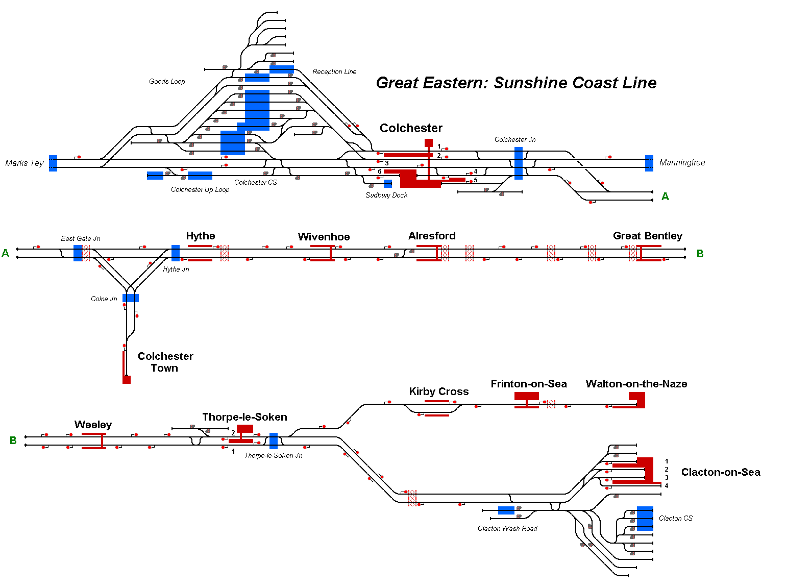

# Sunshine Coast Line
Representation of the route between Colchester and Clacton-on-Sea/Walton-on-the-Naze in Essex, UK.

## Current Status

| Stage         | Status        |
| ------------- |:-------------:|
| Track Plan     | :heavy_check_mark: |
| Signalling      | :heavy_check_mark: |
| Naming | :heavy_check_mark:  |
| Speed Limits | :heavy_check_mark: |
| Distances | :heavy_check_mark: |
| Timetable | :heavy_check_mark: |
| Documentation | :heavy_check_mark: |

## Data Sources
- [OpenTrainTimes](https://www.opentraintimes.com/)
- [National Electronic Sectional Appendix (Anglia December 2021)](https://www.networkrail.co.uk/industry-and-commercial/information-for-operators/national-electronic-sectional-appendix/)
- [Map Meurisse](https://map.meurisse.org/)
- [Walton on Naze to Colchester Town back cab view from train for Greater anglia Day] by Back Cab View on Youtube
- [Walton-on-the-Naze to Colchester (19/05/21)] by Sprinter Boi on Youtube
- [S3 | Greater Anglia | 321 431 Colchester - Clacton-On-Sea] by Great Rail Photography Travel Uk on Youtube
